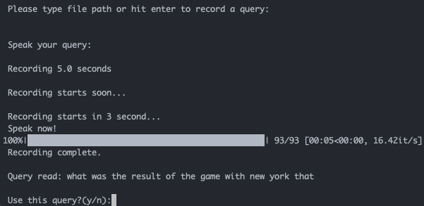
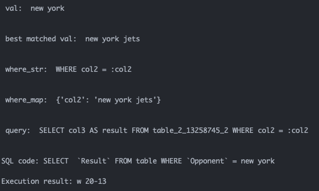
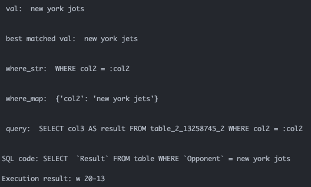
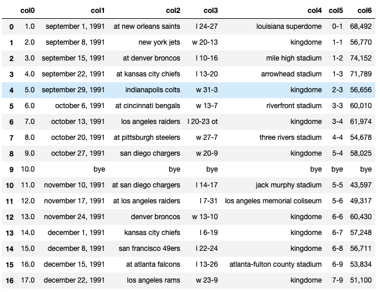

# Voice2sql

A project for getting SQL query from a speech in natural language. A goal will be achieved by implementing
* Noise-robust Automatic Speech Recognition(ASR) engine.
* Natual language to SQL engine.
* Table-aware name correction.

## Installation
* To install the model:
```
bash setup.sh
```
*for Mac users*:
```
bash setup_mac.sh
```
If you want to install it manually here is what `setup.sh` looks like:
```
# Setup virtual environment
conda create -n voice2sql python=3.6 pip
conda activate voice2sql

# Install packages
python -m pip install -r requirements.txt
wget http://download.pytorch.org/whl/cu80/torch-0.2.0.post3-cp36-cp36m-manylinux1_x86_64.whl
python -m pip install torch-0.2.0.post3-cp36-cp36m-manylinux1_x86_64.whl
python -m spacy download en_core_web_sm
wget http://nlp.stanford.edu/software/stanford-corenlp-full-2017-06-09.zip
unzip stanford-corenlp-full-2017-06-09.zip
export CORENLP_HOME=~/nl2sql/stanford-corenlp-full-2017-06-09

# Pretrained NL2SQL model
wget https://voice2sql.s3-us-west-2.amazonaws.com/pretrained.tar.gz
tar -xzvf pretrained.tar.gz

# Pretrained Voice-to-text model
wget https://github.com/mozilla/DeepSpeech/releases/download/v0.7.4/deepspeech-0.7.4-models.pbmm -P deepspeech_data/
wget https://github.com/mozilla/DeepSpeech/releases/download/v0.7.4/deepspeech-0.7.4-models.scorer -P deepspeech_data/

```

## Model
-----------------------------
### Voice to Natural Language Text
**Background**:
- https://github.com/lee-junseok/Membrane
- https://github.com/mozilla/DeepSpeech

A noise-robust Automatic Speech Recognition engine implementing the denoising function from [Membrane Project](https://github.com/lee-junseok/Membrane) and [DeepSpeech](https://github.com/mozilla/DeepSpeech) speech recognition model.

- TensorFlow
- PyAudio
- Librosa


An example of asking ***"What was the result of the game with New York Jets?"***:



- Proper name would not be transcribed exactly.
    - Table-aware name correction will handle this.
-------------------------------------
### Natural Language to SQL
**Background**:
- https://github.com/donglixp/coarse2fine
- https://github.com/prezaei85/nl2sql
- https://github.com/salesforce/WikiSQL

(*must have GPU*)

A natuural language to SQL model trained on the [WikiSQL](https://github.com/salesforce/WikiSQL) table data.
- PyTorch
- RNN
- LSTM
- Attention
- [spaCy](https://spacy.io/)
- [Stanford CoreNLP](https://stanfordnlp.github.io/CoreNLP/)


An example of the query ***"what was the result of the game with new york that"*** from above which is what the model transcribed from the speech asking ***"What was the result of the game with New York Jets?"***:



- The model thought ***that*** is not a part of the name, which makes sense, and found the best-matched name -***New York Jets***- from the table and executed the query with the best-matched name.

Below is another example where ASR reads ***"New York Jets"*** as ***"new york jots"***:



- Corrects a proper name for condition parts of a query.
- Generates SQL query from a natural language query.
- Executes SQL query and gets the result from the table.

- Natural language to SQL can be run separately by running
```
python nl2sql.py (optional arguments)
```
```
(optional arguments):
  -h, --help            Show this help message and exit
  -q, --question        Put your query question (required).
  -c, --config_path     Provide a path to a config file (defualt to `config/model_config.json`).
```
i.e.
```
python nl2sql.py -q "What was the result of the game with New York Jets?"
```
- You can adjust table id in `config/model_config.json` to try other WikiSQL table.
- To explore a table:

i.e. in a jupyter notebook
```
import sqlite3
import pandas as pd
fdb = 'pretrained/wikisql/data/test.db'
cnx = sqlite3.connect(fdb)
df = pd.read_sql('SELECT * FROM table_2_13258745_2', cnx)
df
```

------------------------------
## Todo
Update dependencies to the latest versions.

## Contact
For questions or comments, feel free to reach out to lee.junseok39@gmail.com. Thank you!


